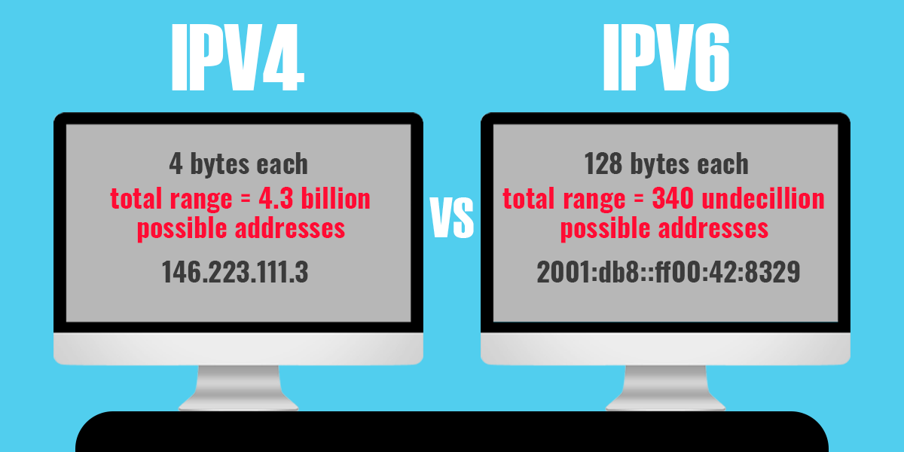
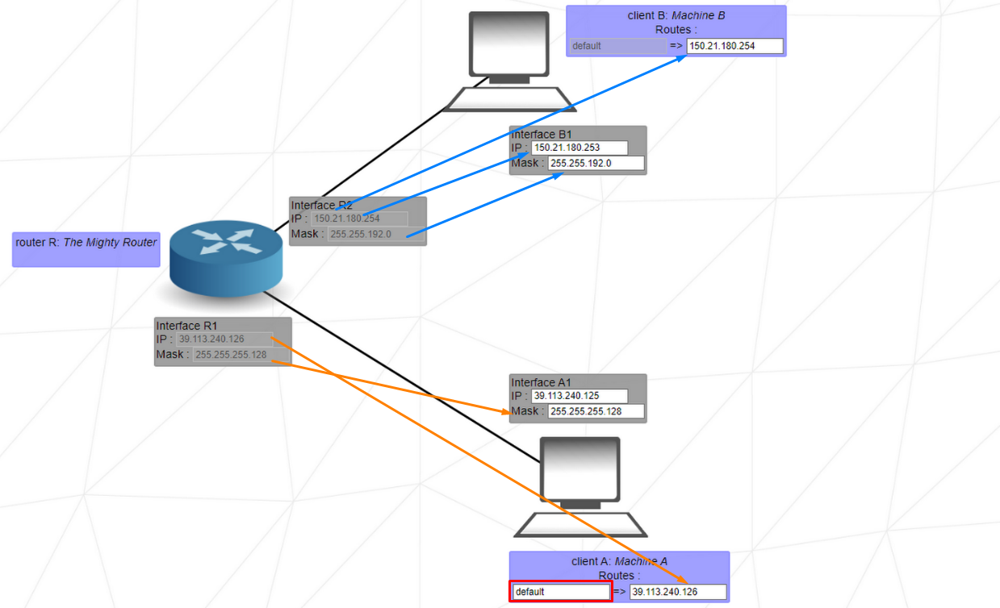

<h1 style="text-align:center">NetPractice Helper</h1>

## Guidance
- [What is NetPractice](#whatis?)
  - [TCP](#TCP)
  - [How To Work](#How?) 
  - [IP's](#Ip's)
  - [Subnet Mask](#Subnet)
- [Components](#Components)
  - [Host](#Host)
  - [Switch](#Switch)
  - [Router](#Router)
- [Solutions](#solutions)

## What is?
If we look at the project PDF, we can see the following statement. **This project is a general practical exercise to let you discover networking**. So we can move on to exploring the world of the network.

### TCP
</br>
<p align="center">
  <kbd></kbd>
</p>
</br>

TCP **(Transmission Control Protocol)**, it is a protocol that enables communication between computers to be carried out in small packets and without loss. The most important part of this protocol is to receive or send data as a whole. Protocols and data records of terms we come across in daily life such as HTTP, HTTPS, POP3, SSH, SMTP, TELNET and FTP are made in TCP form.

### How?

</br>
<p align="center">
  <kbd></kbd>
</p>
</br>

The working logic of the TCP protocol can be examined under three headings. In the first step, a connection **request** is sent to the destination. In the second stage, the connection is confirmed and **data transfer begins.** In the third stage, the connection is terminated by sending it to the parties where the **data transfer is completed.** The realization of these three stages is defined as the **State** process.

In TCP, some intermediate situations also occur for the realization of these three main stages. These intermediate states are listed as follows:

#### LISTEN
The state in which a TCP connection request is expected by the server. It is called the listening mode.

#### SYN-SENT
After sending a TCP connection request to the other party, it is called the situation where the connection request from the other party is expected to be answered.

#### SYN-RECEIVED
If the server responds with the SYN-ACK flag to the connection request made with the SYN flag, it is called the next wait state.

#### ESTABLISHED
It is the state where the data transfer is made after the connection setup is finished.

#### FIN-WAIT-1
It is the wait state of the server and its environment.

#### FIN-WAIT-2
FIN_WAIT_2 seems to occur when the server has an active connection with a client and wants to shut down the TCP connection.

#### CLOSE-WAIT
It is the state in which a connection closure request is expected by the server and the client.

#### CLOSING
After an ACK flag is sent to the other party to terminate the connection is called the wait for the connection to end.

#### LAST-ACK
The state where the ACK flag is expected.

#### TIME-WAIT
It is a standby state.

#### CLOSED
It is called the state where TCP data is completely exhausted.

### Ip's
</br>
<p align="center">
  <kbd></kbd>
</p>
</br>

IP (Internet Protocol), it is defined as a protocol that provides routing of packets between two computers. The nature of the data is not important in IP and this protocol only determines the destination address, regardless of the data content. 

**Every device connected to the Internet must have a unique IP address.** In this project, we will only use the **IPv4** protocol. But we can compare with **IPv6.**

#### IPv4 vs IPv6
</br>
<p align="center">
  <kbd></kbd>
</p>
</br>

While the maximum number of IPv4 addresses may seem like a lot, it is not enough to move all connected devices around the world, especially with the rise of Internet of Things (IoT) devices. Therefore, IPv6 fulfills the need for more internet addresses. However, the use of IPv4 is still needed as the world adopts this protocol.

While many major content providers, such as Facebook and Netflix, are now accessible via IPv6, only 19.1% of Alexa's top ten million websites can be accessed via this protocol, suggesting that there is still a long way to go before fully adopting IPv6.

#### Public Adresses and Private Adresses

A public IP address identifies you to the wider internet so that all the information you’re searching for can find you. A private IP address is used within a private network to connect securely to other devices within that same network.

</br>
<p align="center">
  <kbd></kbd>
</p>
</br>
Your private IP address exists within specific private IP address ranges reserved by the Internet Assigned Numbers Authority (IANA) and should never appear on the internet. There are millions of private networks across the globe, all of which include devices assigned private IP addresses within these ranges:

```
- Class A: 10.0.0.0 — 10.255.255.255 (16,777,216 IP addresses)

- Class B: 172.16.0.0 — 172.31.255.255 (1,048,576 IP addresses)

- Class C: 192.168.0.0 — 192.168.255.255 (65,536 IP addresses)
```

These might not seem like wide ranges, but they don’t really need to be. Because these IP addresses are reserved for private network use only, they can be reused on different private networks all over the world — without consequence or confusion. 

And don’t be surprised if you have a device or two at home with a so-called 192 IP address, or a private IP address beginning with 192.168. This is the most common default private IP address format assigned to network routers around the globe.

Unsurprisingly, the public IP address range encompasses every number not reserved for the private IP range. Since a public IP address is a unique identifier for each device connected to the internet, it needs to be just that: unique.

### Subnet
</br>
<p align="center">
  <kbd></kbd>
</p>
</br>
A subnet mask is a **32 bits** address used to distinguish between a network address and a host address in IP address. A subnet mask identifies which part of an IP address is the network address and the host address. They are not shown inside the data packets traversing the Internet. They carry the destination IP address, which a router will match with a subnet.

</br>
<p align="center">
  <kbd></kbd>
  represent network 0 
</p>
</br>

- The default Subnet Mask is the number of bits which is reserved by the address class. Using this default mask will accommodate a single network subnet in the relative class.
- A Custom Subnet Mask can be defined by an administrator to accommodate many Network

#### How to Use a Subnet Mask?
The subnet mask is used by the router to cover up the network address. It shows which bits are used to identify the subnet.

Every network has its own unique address, Like here, class B network has network address 172.20.0.0, which has all zeroes in the host portion of the address.

Example IP address: 11000001. Here 1st and 2nd bits are 1, and the 3rd bit is 0; hence, it is class C.
</br>
<p align="center">
  <kbd></kbd>
  How to identify which class the IP address belongs to
</p>
</br>
Above example shows how IP addresses should be deconstructed, which makes it simple for Internet routers to find the right Network to route data into. However, in a Class A network there could be millions of connected devices, and it could take some time for the router to find the right device.

## Components
Components, digital devices or other things that help us with operations on the network, we will see a few here.

### Host
</br>
<p align="center">
  <kbd></kbd>
</p>
</br>
A host is a computer or other device connected to a computer network.

### Switch
</br>
<p align="center">
  <kbd></kbd>
</p>
</br>
A switch is a device in a computer network that connects other devices together

### Router
</br>
<p align="center">
  <kbd></kbd>
</p>
</br>
A router is a device that connects two or more packet-switched networks or subnetworks. It serves two primary functions: managing traffic between these networks by forwarding data packets to their intended IP addresses, and allowing multiple devices to use the same Internet connection.

#### Routing Table
A routing table is a data table stored in a router or a network host that lists the routes to particular network destinations. In NetPractice, the routing table consists of 2 elements:

- **Destination:** The destination specifies a network address on which a host is the end target of the packets. The route of default or 0.0.0.0/0, is the route that takes effect when no other route is available for an IP destination address. The default route will use the next-hop address to send the packets on their way without giving a specific destination. The default route will match any network.

- **Next hop:** The next hop refers to the next closest router a packet can go through. It is the IP address of the next router on the packet's way. Every single router maintains its routing table with a next hop address.

## Solutions
<details>
  <summary>Level 1</summary>
  <br>
    
  <br>
  <br>

**1.** Since *Client A* and *Client B* are on the same network, that's why we need to pay attention to this when solving.
<br>
The subnet mask is *255.255.255.0*, which means that the first 3 bytes of the IP address represent the network, and the 4th byte represents the host.
<br>
Let's then we have 104.99.23.0 - 104.99.23.255 range.

**2.** The same reasoning as *1.*, however the subnet mask is *255.255.0.0* in this case. The first 2 bytes of the IP address will represent the network; and the last 2 bytes, the host address.
<br>
Let's then we have 211.191.0.0 - 211.191.255.255 range.
</details>

<details>
  <summary>Level 2</summary>
  <br>
    
  <br>
  <br>

We can use something like this when calculating IP ranges.

```
256 -> 255 + 1 = 256
252 -> Client C , Client D Mask
-__
004 -> we can give ip to connected PCs in every 4 ranges. Assuming you don't understand now "What?"

Okey let's check this table. Whenever you see a collection of computers with the same network ip, you can use this to determine the host ip's. We found 4 with the easy formula above.
------------------- Not Usable:
- 0 > .. < 4      - 0 Network address and 3 Brodcast address
- 4 > .. < 8      - 4 Network address and 7 Brodcast address
- 8 > .. < 12     - 8 Network address and 11 Brodcast address
- 12 > .. < 16    - 12 Network address and 15 Brodcast address
- 16 > .. < 20    - 16 Network address and 19 Brodcast address
- ...             -
- ...             -
- 248 > .. < 252  - 248 Network address and 251 Brodcast address
- 252 > .. < 255  - 252 Network address and 255 Brodcast address
-------------------
```
I don't recommend it, but you can take a [look](https://www.calculator.net/ip-subnet-calculator.html). Don't open it during evaluation. Such tools are illegal. 

**You can figure out the rest, right?**
</details>

<details>
  <summary>Level 3</summary>
  <br>
    
  <br>
  <br>

**This exercise introduces the use of the switch (Switch S in this example). The switch links multiple hosts of the same network together.**

Client A, Client B, and Client C are all on the same network. Pay attention to this and set the ip address and mask accordingly.
</details>

<details>
  <summary>Level 4</summary>
  <br>
    
  <br>
  <br>

**This exercise introduces the router. The router is used to link multiple networks together. It does so with the use of multiple interfaces (Interface R1, Interface R2, and Interface R3 in this example).**

The reason why I use the 255.255.255.240 mask in most parts is because it gives me a large number of ip ranges and it is comfortable to set these ranges when a multi-PC environment occurs.
</details>

<details>
  <summary>Level 5</summary>
  <br>
    
  <br>
  <br>

**This level introduces routes. A route contains 2 fields, the first one is the destination of outbound packets, the second one is the next hop of the packets.**

The destination default is equivalent to 0.0.0.0/0, which will send the packets i gndiscriminately to the first network address it encounters. A destination address of 122.3.5.3/24 would send the packets to the network 122.3.5.0.

The next hop is the IP address of the next router (or internet) interface to which the interface of the current machine must send its packets.
</details>

<details>
  <summary>Level 6</summary>
  <br>
    
  <br>
  <br>

**This level introduces the internet. The internet behaves like a router. However, if an interface is connected directly or indirectly to the internet, it cannot have an IP address in the following reserved private IP ranges:**

```
192.168.0.0 - 192.168.255.255 (65,536 IP addresses)

172.16.0.0 - 172.31.255.255   (1,048,576 IP addresses)

10.0.0.0 - 10.255.255.255     (16,777,216 IP addresses)
```

The /24 statement determines the range of the ip address that will be spread over the internet, you may need to look at [this](https://networkencyclopedia.com/wp-content/uploads/2019/09/subnet-mask-cheat-sheet.jpg).
</details>

<details>
  <summary>Level 7</summary>
  <br>
    
  <br>
  <br>

**This level introduces the concept of overlaps. The range of IP addresses of a network must not overlap the range of IP addresses of a separate network. Networks are separated by routers.**

Here again, we can use 240 if we want the redundancy of the ranges of the IP addresses.
</details>

<details>
  <summary>Level 8</summary>
  <br>
    
  <br>
  <br>

**This level can confuse you just because it's redundant.**
</details>

<details>
  <summary>Level 9</summary>
  <br>
    
  <br>
  <br>

**This level is quite straightforward since the internet does not initially send its packets to a specific network. Therefore, the separate networks do not need to share a common address range. I would suggest simply following the 6 goals of the level one by one until the level is completed.**

- Remember not to use the network addresses from the reserved private IP ranges.

- Look at the tips given to you in the upper left. These are your goals, set them according to who will open the internet in internet Routes!
</details>

<details>
  <summary>Level 10</summary>
  <br>
    
  <br>
  <br>

**You can figure out the rest, right?**
</details>